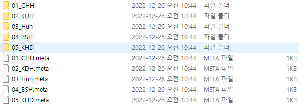

# Project_VAX


> Project VAX는 Unity 2020.3.41f1 버전으로 제작한 팀프로젝트입니다. 
<br/> **프로젝트 기간** : 2022년 11월 10일 ~ 2022년 12월 9일
<br/> **개발 인원**    : 4명
<br/> **게임 장르**    : TPS, Mafia
<br/> **노션 주소**    : [노션](https://www.notion.so/Unity-C-117ac0c996df4ac284e2e8bdd6b7a7f2?p=a79261e78b964848b5b0d3b542dd25f2&pm=c)

:bulb:   Git-구성
------------------------
* 01_Assets 부터 10_URP로 공통된 폴더 명으로 작업하였습니다.
  * 각각의 폴더에는 번호_이니셜로 구성된 폴더로 팀 작업 폴더를 구분하였습니다.
    * git 용량 제한으로 용량이 큰 Asset, Animation, Img, Scene 파일은 제외되었습니다.

07_Scripts 폴더


💾 김동훈 Git 작업 내역
------------------------

```C#
#include<stdio.h>

int main(void){
printf("Hello World!");
return 0;
}

```

#### Git-Tutorial

순서 없는 목록은 다음과 같이 작성할 수 있습니다.

* 깃 튜토리얼
  * 깃 Clone
    * 깃 Pull
    * 깃 Commit
   
인용 구문은 다음과 같이 작성할 수 있습니다.

> '공부합시다 ' -나동빈

테이블은 다음과 같이 작성할 수 있습니다.

이름|영어|정보|수학
---|---|---|---|
나동빈|98점|87점|72점

강조는 다음과 같이 할 수 있습니다.

**치킨** 먹다가 ~~두드리기~~났어요.
