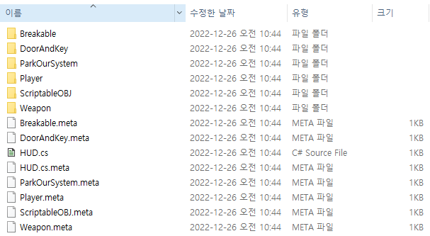

# Project_VAX

> Project VAX는 Unity 2020.3.41f1 버전으로 제작한 팀프로젝트입니다. 
  **프로젝트 기간** : 2022년 11월 10일 ~ 2022년 12월 9일
  **개발 인원**    : 5명
  **게임 장르**    : TPS, Mafia
  **노션 주소**    : [노션](https://www.notion.so/Unity-C-117ac0c996df4ac284e2e8bdd6b7a7f2?p=a79261e78b964848b5b0d3b542dd25f2&pm=c)

:bulb:   Git-구성
------------------------
* 01_Assets 부터 10_URP로 공통된 폴더 명으로 작업하였습니다.
  * 각각의 폴더에는 번호_이니셜로 구성된 폴더로 팀 작업 폴더를 구분하였습니다.
    * git 용량 제한으로 용량이 큰 Asset, Animation, Img, Scene 파일은 제외되었습니다.

07_Scripts 폴더

💾 김동훈 Git 작업 내역
------------------------
>>Assets>07_Scripts>02_KDH 폴더 안에서 제가 작업한 코드 Script를 확인할 수 있습니다.
* 제가 Project VAX에서 작업한 Player Part입니다.
  * Player 폴더에서 이동, 아이템 상호작용, 스테이터스 변경, 플레이어의 Photon PUNRPC를 작업한 내용을 확인할 수 있습니다.
  * ParkourSystem 폴더에서 Player의 Parkour 기능을 구현한 작업 내용을 확인할 수 있습니다.
  * Weapon 폴더에서 Player의 무기 착용, 무기 공격, 애니메이션 로직, 무기의 정보 Class 등의 작업 내용을 확인할 수 있습니다.  
  * DoorAndKey 폴더에서 문을 열고 닫는 로직을 작업한 내용을 확인할 수 있습니다.
  * Breakable 폴더에서 파괴 Effect를 구현하기 위해 작업한 내용을 확인할 수 있습니다.
  * ScriptableOBJ 폴더에 Parkour와 Item을 Scriptable Asset으로 저장하였습니다.

:blue_book: GitLab History
------------------------

:nail_care: README.md Version ManageMent
------------------------

색인|버전|날짜|월|일|작업 내용
---|---|---|---|---|---|
1|V1.0|2022년|12월|26일|최초 README.md Commit

